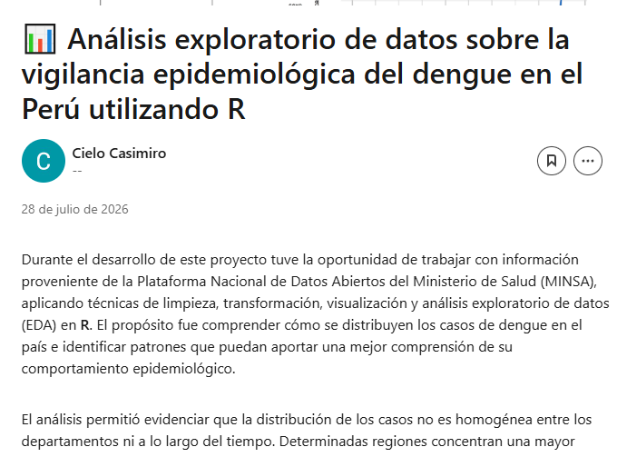

# Vigilancia Epidemiológica del Dengue en el Perú — Análisis Exploratorio de Datos (EDA)

Trabajo final del curso desarrollado en **R**. Este proyecto realiza un análisis exploratorio de datos (EDA) y un análisis descriptivo de los casos de dengue reportados en el Perú utilizando información proveniente de la Plataforma Nacional de Datos Abiertos del Ministerio de Salud (MINSA). El objetivo es identificar patrones según el año, departamento, sexo y edad de los casos registrados, apoyándose en técnicas de visualización y estadística descriptiva.

---

# 1. Contexto del conjunto de datos

**Institución que proporciona los datos:** Ministerio de Salud del Perú (MINSA).

**Fuente de información:** Plataforma Nacional de Datos Abiertos del Estado Peruano.

**Objetivo / temática:** La base de datos contiene los casos de dengue notificados por el sistema de vigilancia epidemiológica del Perú. La información permite analizar la evolución temporal de la enfermedad, así como su distribución geográfica y demográfica.

**Fuente oficial:**

https://www.datosabiertos.gob.pe/

## Principales variables analizadas

- **ano:** año de notificación del caso.
- **semana:** semana epidemiológica.
- **departamento:** departamento donde se registró el caso.
- **provincia:** provincia del caso reportado.
- **sexo:** sexo del paciente.
- **edad:** edad del paciente.
- **diagnostic:** clasificación diagnóstica del caso.
- **grupo_edad:** variable creada para clasificar a los pacientes por grupos etarios.

---

# 2. Importación de datos

Los datos fueron importados desde un archivo CSV utilizando la librería **readr** del paquete **tidyverse**. Posteriormente se verificó la estructura de la base mediante funciones exploratorias para identificar las variables disponibles y comprobar la consistencia de los registros.

---

# 3. Limpieza y preparación de los datos

Durante la etapa de preparación de los datos se realizaron las siguientes actividades:

- Eliminación de registros duplicados.
- Conversión de la variable edad a formato numérico.
- Eliminación de edades inválidas (menores de 0 o mayores de 120 años).
- Creación de la variable **grupo_edad**.
- Revisión de valores perdidos.
- Estandarización de nombres de variables mediante la librería **janitor**.

---

# 4. Estadísticas descriptivas

Se calcularon diversos indicadores descriptivos con el propósito de caracterizar la base de datos.

Entre ellos:

- Número total de registros.
- Edad promedio.
- Mediana.
- Edad mínima.
- Edad máxima.
- Desviación estándar.
- Número de casos por año.
- Número de casos por sexo.
- Número de casos por departamento.
- Número de casos por grupo etario.

---

# 5. Visualizaciones

Los gráficos generados se encuentran almacenados dentro de la carpeta **figures/**.

Entre ellos se incluyen:

- Distribución de casos por departamento.
- Histograma de edades según sexo.
- Casos reportados por año.
- Mapa de calor por departamento y año.
- Distribución porcentual por sexo.
- Boxplot de edades.
- Evolución temporal de los casos.
- Collage resumen del análisis.

---

# Parte 2 — Análisis dirigido

## Pregunta de investigación

**¿Cómo se distribuyen los casos de dengue registrados en el Perú según el sexo, la edad, el departamento y el año de ocurrencia, y qué patrones pueden identificarse a partir de estas variables?**

---

# Análisis

El análisis complementario fue desarrollado en el archivo:

```
scripts/04_analisis_final.R
```

Se realizaron:

- Estadísticas descriptivas ampliadas.
- Tablas resumen.
- Tablas cruzadas entre sexo y grupo etario.
- Distribución temporal de los casos.
- Distribución geográfica por departamentos.
- Análisis de correlación entre el año y el número de casos.
- Elaboración de gráficos profesionales utilizando **ggplot2**.

---

# Principales hallazgos

- La distribución de los casos de dengue no es uniforme entre los departamentos del Perú.
- Se identifican años con incrementos importantes en el número de casos registrados.
- Los adultos representan el grupo etario con mayor cantidad de registros.
- Hombres y mujeres presentan una distribución relativamente similar de los casos.
- Los departamentos con mayor incidencia concentran una proporción importante de los registros nacionales.

---

# Conclusiones

El análisis exploratorio permitió identificar patrones espaciales, temporales y demográficos en los casos de dengue registrados por el sistema de vigilancia epidemiológica.

Los resultados muestran que la incidencia del dengue presenta variaciones importantes entre los distintos años de estudio, evidenciando el comportamiento dinámico de la enfermedad.

Asimismo, la mayor concentración de casos se registra en determinados departamentos, lo que refleja diferencias territoriales asociadas a factores ambientales, climáticos y epidemiológicos.

Respecto a las características de los pacientes, el grupo de adultos concentra la mayor cantidad de registros, mientras que la distribución por sexo presenta diferencias poco marcadas.

Finalmente, el análisis confirma la utilidad de las técnicas de análisis exploratorio de datos para describir el comportamiento epidemiológico del dengue y generar evidencia que facilite la toma de decisiones en salud pública.

---

# Publicación

El gráfico principal generado en el análisis final fue publicado en **LinkedIn** como evidencia del desarrollo del proyecto.

La captura de la publicación se incluye en este repositorio.

---

# Estructura del repositorio

```
Proyecto_Final/

├── data/
│   └── Proyecto_Final.csv
│
├── figures/
│   ├── collage_graficos.png
│   ├── collage_analisis_final.png
│   ├── grafico_linkedin.png
│   └── ...
│
├── scripts/
│   ├── EDA.R
│   └── 04_analisis_final.R
│
├── README.md
│
└── TRABAJO_FINAL.Rproj
```
## Publicación en LinkedIn


